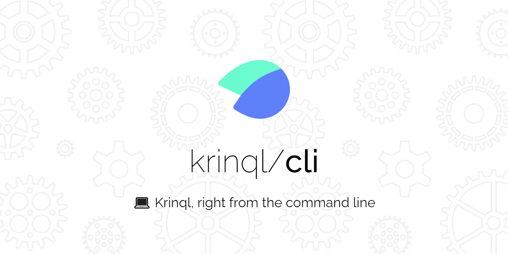
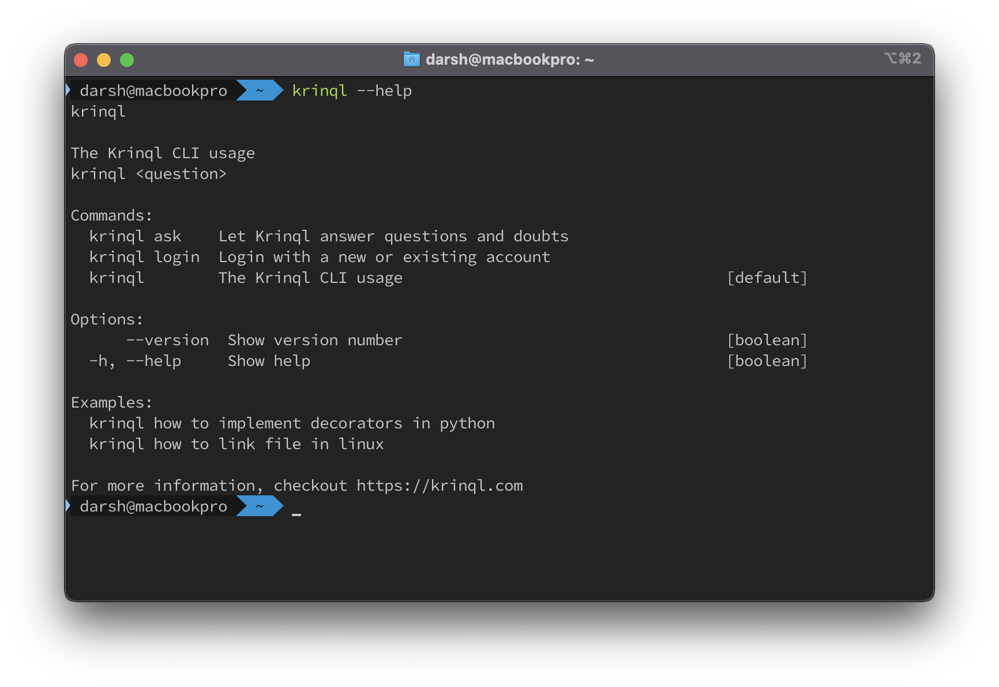

# Krinql CLI

</a>

<p align="center">
  <a href="https://www.npmjs.com/package/krinql-cli/">
      
  </a>
  <a href="https://www.npmjs.com/package/krinql-cli/">
    
  </a>
  <a href="https://github.com/krinql/cli/actions/workflows/publish-packages.yml">
    
  </a>
  <a href="https://github.com/krinql/cli/blob/main/LICENSE.md">
    
  </a>
</p>

## Installation

### npm
```shell
$ npm i -g krinql-cli
```

### yarn

```shell
$ yarn global add krinql-cli
```

### npx
```shell
$ npx krinql-cli login
$ npx krinql-cli <question>
```

## Install from binary
### Linux
```shell
$ wget -O krinql.tar.gz https://github.com/krinql/cli/releases/latest/download/krinql-linux-x64.tar.gz
$ tar -xzf krinql.tar.gz
$ sudo mv krinql /usr/local/bin/
$ krinql <command>
```

### Windows
```powershell
> wget https://github.com/krinql/cli/releases/latest/download/krinql-win-x64.exe -o krinql.exe
> .\krinql.exe <command>
```
To make the command systemwide, add the executable to PATH variable.

## Usage

Use the following command to login to Krinql

```shell
$ krinql login
```

To ask a question, use
```shell
$ krinql <question>
```

For help, use
```shell
$ krinql --help
```

